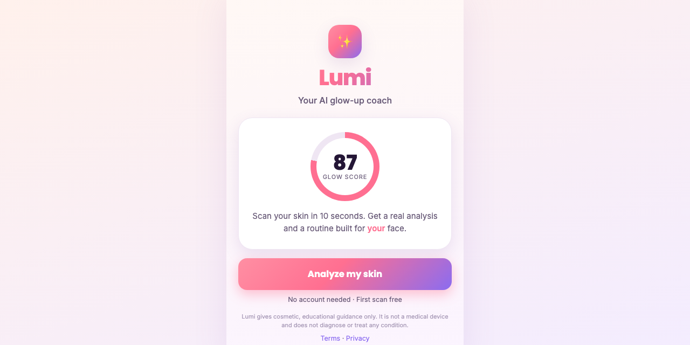

# Lumi — AI Skin & Glow-Up Coach

[](https://suncal.github.io/lumi/) [](LICENSE) [](https://github.com/suncal/lumi/stargazers)



A working, self-contained web app that scans a selfie, computes a **real** skin analysis from the
photo's pixels, returns a personalized routine, tracks progress, and gates the routine behind a
weekly-trial paywall. Built to be shipped to the web today and wrapped for the App Store next.

```
glowup/
├── index.html            # all app screens (start → capture → analyze → results → paywall → routine → progress)
├── styles.css            # mobile-first, premium beauty-app UI
├── app.js                # skin-analysis engine + flow + paywall + Stripe-return unlock + progress
├── terms.html            # Terms of Service (template — fill [brackets])
├── privacy.html          # Privacy Policy (template — fill [brackets])
├── capacitor.config.json # native iOS app config
├── package.json          # Capacitor deps + scripts
├── build.sh              # copies web assets into www/ for the native bundle
├── setup-ios.sh          # one command → generates the iOS project
├── IOS_SETUP.md          # full App Store shipping guide (incl. RevenueCat IAP)
├── APP_STORE_LISTING.md  # ASO-optimized name/subtitle/keywords/description/screenshots
├── CONTENT_ENGINE.md     # the faceless TikTok/Reels/Shorts strategy
├── CONTENT_WEEK1.md      # 25 ready-to-shoot launch scripts (7-day batch)
└── README.md
```

## Run it now
```bash
cd glowup
python3 -m http.server 4321
# open http://localhost:4321  (use a phone or device-toolbar in Chrome)
```
The camera button works on a real phone; on desktop it falls back to photo upload.

## What's genuinely real vs. what you plug in
**Real and working today**
- The skin analysis is **actual computer vision on your photo** — it detects the facial skin region (YCbCr skin model + elliptical crop) and measures radiance, even-tone, hydration/shine, texture/pores, redness, and dark spots. No `Math.random()`, no fake scores.
- Full app flow, personalized routine generation, progress tracking + before/after, weekly-trial paywall UI.

**Wired and ready — you just add your accounts**
1. **Web payments (5 min):** create a Stripe Payment Link, set its success URL to `https://YOUR-SITE/index.html?status=success`, and paste the link into `CONFIG.stripeLink` in `app.js`. The return-from-checkout unlock is already wired — paying users land straight on their routine. (Verified end-to-end.)
2. **App Store (a few hours):** run `bash setup-ios.sh` → native iOS project. For paid subs Apple requires in-app purchase, so add **RevenueCat** — full steps in `IOS_SETUP.md`. Needs an Apple Developer account ($99/yr).
3. **Legal:** fill the `[bracketed]` fields in `terms.html` / `privacy.html`, host them at public URLs, link them in App Store Connect.

**Optional**
- **Richer analysis** — pipe the selfie to a vision model (e.g. Claude vision) server-side and merge with the on-device metrics. Keep it server-side so no key ships in the app (and update Privacy §1 if photos leave the device).

## Honest disclaimer (already in the UI — keep it)
Lumi is **cosmetic guidance, not a medical device.** It does not diagnose, treat, or prevent any
condition. This wording matters: skin *diagnosis* claims can trigger FDA medical-device rules and
App Store rejection. Stay in the "cosmetic coaching / glow-up" lane.

## The honest path to revenue
1. Ship the web app + Stripe link → smoke-test demand this week (run the CONTENT_ENGINE plan).
2. If videos drive installs and scanners convert → wrap with Capacitor and ship to the App Store.
3. Scale the only lever that matters: **daily content volume.** See `CONTENT_ENGINE.md`.

Base rates are harsh (only ~8% of new apps clear $100k/yr). Your edge isn't the code — anyone can
clone the mechanic — it's that you can *drive the traffic*. That's the whole bet.

---

**If this is useful to you, a ⭐ on the repo helps other people find it.** Issues and pull requests are welcome.

Built by [Priyankar "Sunny" Chakraborty](https://github.com/suncal) · [everbuiltstudio.com](https://everbuiltstudio.com)
